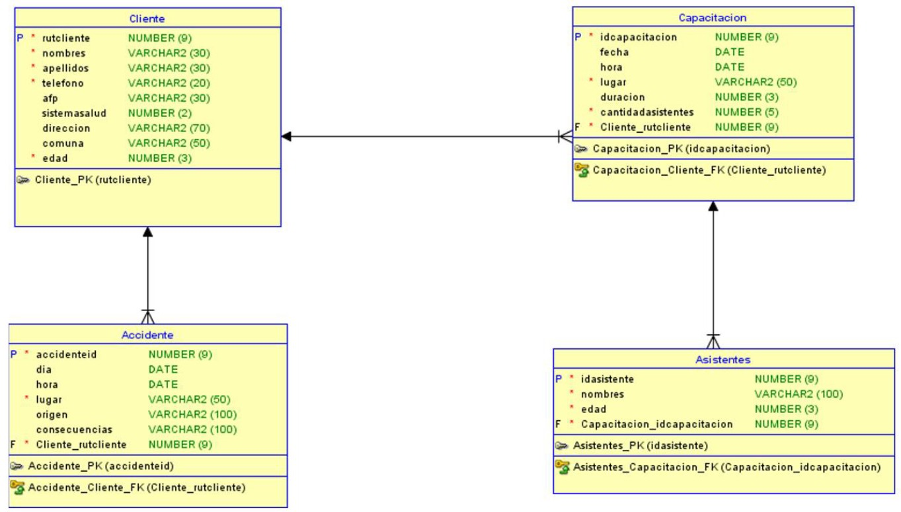
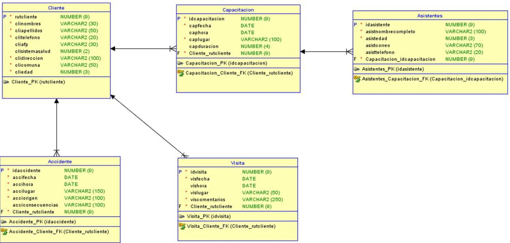
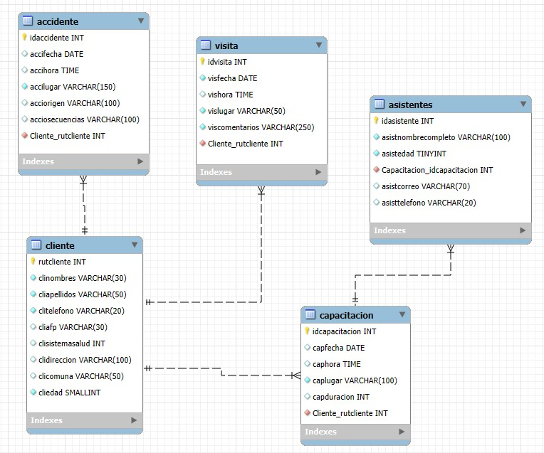

**_<h1 align="center">:vulcan_salute: BBDD Empresa de Asesorías en Prevención de Riesgos M4_ABPRO2_AE4:computer:</h1>_**


**<h3>:blue_book: Contexto de la Actividad:</h3>**

<p>Este ejercicio es la continuación del ejercicio grupal del día anterior.</p>
<p>Una empresa de asesorías en prevención de riesgos necesita contar con un sistema de información que le permita administrar los principales procesos que se llevan a cabo en ella día a día.</p>
<p>Hasta antes de la última reunión del equipo de proyecto, el modelo de datos se veía de la siguiente manera:</p>



<p>Como resultado de esta reunión, se consideró pertinente hacer mejoras al modelo de datos, modificando algunos campos, eliminando otros y agregando nuevas tablas. En conjunto se decidió que el nuevo modelo de datos quedaría de la siguiente manera:</p>



**<h3>:orange_book: Requerimiento:</h3>**

<p>Se solicita que desarrolle un conjunto de sentencias SQL que permita pasar desde el modelo de datos original al modelo de datos actualizado, utilizando las consultas vistas en la clase. No es necesario que sea solo una consulta, lo puede hacer en base a una transacción que tenga un inicio y fin determinados, con consultas independientes, pero que forman parte de un conjunto mayor de instrucciones.</p>
<p>Considere que se piden solo las consultas de actualización, no el modelo completo.</p>
<p><b>Nota:</b> No se permite la eliminación y posterior creación de tablas; puede eliminar o modificar campos de una tabla.</p>

**<h3>:green_book: Construcción de la Base de Datos Original:</h3>**

<p>ABPRO AE4 – MODELO ENTIDAD RELACIÓN (DDL) - TABLA INICIAL</p>

```SQL
-- ======================================================
-- 1) CLIENTE
-- ======================================================
CREATE TABLE cliente (
  rutcliente        INT PRIMARY KEY NOT NULL,
  nombres           VARCHAR(30) NOT NULL,
  apellidos         VARCHAR(30) NOT NULL,
  telefono          VARCHAR(20) NOT NULL,
  afp               VARCHAR(30),
  sistemasalud      INT,
  direccion         VARCHAR(70),
  comuna            VARCHAR(50),
  edad              SMALLINT NOT NULL
 -- CONSTRAINT Cliente_PK PRIMARY KEY (rutcliente)
);

-- ======================================================
-- 2) CAPACITACION
-- ======================================================
CREATE TABLE capacitacion (
  idcapacitacion INT AUTO_INCREMENT PRIMARY KEY NOT NULL,
  fecha DATE,
  hora TIME,
  lugar VARCHAR(50) NOT NULL,
  duracion INT,
  cantidadasistentes INT NOT NULL,
  Cliente_rutcliente INT NOT NULL,
  -- CONSTRAINT Capacitacion_PK PRIMARY KEY (idcapacitacion),
  KEY Capacitacion_Cliente_FK (Cliente_rutcliente),
  CONSTRAINT Capacitacion_Cliente_FK
    FOREIGN KEY (Cliente_rutcliente)
    REFERENCES cliente (rutcliente)
    ON DELETE CASCADE ON UPDATE CASCADE
);

-- ======================================================
-- 3) ASISTENTES
-- ======================================================
CREATE TABLE asistentes (
  idasistente INT AUTO_INCREMENT PRIMARY KEY NOT NULL,
  nombres VARCHAR(100) NOT NULL,
  edad TINYINT NOT NULL,
  Capacitacion_idcapacitacion INT NOT NULL,
  -- CONSTRAINT Asistentes_PK PRIMARY KEY (idasistente),
  KEY Asistentes_Capacitacion_FK (Capacitacion_idcapacitacion),
  CONSTRAINT Asistentes_Capacitacion_FK
    FOREIGN KEY (Capacitacion_idcapacitacion)
    REFERENCES capacitacion (idcapacitacion)
    ON DELETE CASCADE ON UPDATE CASCADE
);

-- ======================================================
-- 4) ACCIDENTE
-- ======================================================
CREATE TABLE accidente (
  accidenteid INT PRIMARY KEY NOT NULL AUTO_INCREMENT,
  dia DATE,
  hora TIME,
  lugar VARCHAR(50) NOT NULL,
  origen VARCHAR(100),
  consecuencias VARCHAR(100),
  Cliente_rutcliente INT NOT NULL,
  -- CONSTRAINT Accidente_PK PRIMARY KEY (accidenteid),
  KEY Accidente_Cliente_FK (Cliente_rutcliente),
  CONSTRAINT Accidente_Cliente_FK
    FOREIGN KEY (Cliente_rutcliente)
    REFERENCES cliente (rutcliente)
    ON DELETE CASCADE ON UPDATE CASCADE
);

-- ============================
-- Verificación rápida
-- ============================
SHOW TABLES;
SHOW CREATE TABLE cliente;
SHOW CREATE TABLE capacitacion;
SHOW CREATE TABLE asistentes;
SHOW CREATE TABLE accidente;
```

**<h3>:blue_book: Consultas ejecutadas:</h3>**

<p>Modificando la base de datos migrando desde el esquema actual sin eliminar tablas.</p>
<p>Ejecutado paso a paso en este orden:</p>

```SQL
-- PASO 1 — CLIENTE → columnas del diagrama
-- Renombrar columnas
ALTER TABLE cliente
  RENAME COLUMN nombres           TO clinombres,
  RENAME COLUMN apellidos         TO cliapellidos,
  RENAME COLUMN telefono          TO clitelefono,
  RENAME COLUMN afp               TO cliafp,
  RENAME COLUMN sistemasalud      TO clisistemasalud,
  RENAME COLUMN direccion         TO clidireccion,
  RENAME COLUMN comuna            TO clicomuna,
  RENAME COLUMN edad              TO cliedad;

-- -> Verificando
DESCRIBE cliente;
SHOW CREATE TABLE  cliente;

-- ===========================================================
-- PASO 2 — CAPACITACION → columnas del diagrama
-- Renombrar columnas
ALTER TABLE capacitacion
  RENAME COLUMN fecha           TO capfecha,
  RENAME COLUMN hora            TO caphora,
  RENAME COLUMN lugar           TO caplugar,
  RENAME COLUMN duracion        TO capduracion;

-- Eliminar columna
ALTER TABLE capacitacion
  DROP COLUMN cantidadasistentes;

-- Verifica
DESCRIBE capacitacion;
SHOW CREATE TABLE capacitacion;

-- ===========================================================
-- PASO 3 — VISITA → tabla nueva del diagrama
CREATE TABLE visita (
    idvisita INT AUTO_INCREMENT PRIMARY KEY NOT NULL,
    visfecha DATE NOT NULL,
    vishora TIME,
    vislugar VARCHAR(50) NOT NULL,
    viscomentarios VARCHAR(250) NOT NULL,
    Cliente_rutcliente INT NOT NULL,
    CONSTRAINT Visita_Cliente_FK FOREIGN KEY (Cliente_rutcliente) REFERENCES cliente(rutcliente)
        ON DELETE CASCADE ON UPDATE CASCADE
);
 
-- ->Verifica
DESCRIBE visita;
SHOW CREATE TABLE visita;

-- ===========================================================
-- PASO 4 — ASISTENTE → columnas del diagrama
-- -> Renombrar columnas
ALTER TABLE asistentes
  RENAME COLUMN nombres		TO asistnombrecompleto,
  RENAME COLUMN edad        TO asistedad;

-- -> Añadir columnas segun diagrama
ALTER TABLE asistentes
  ADD COLUMN asistcorreo VARCHAR(70),
  ADD COLUMN asisttelefono VARCHAR(20);

-- ->Verifica
DESCRIBE asistentes;
SHOW CREATE TABLE asistentes; 

-- ===========================================================
-- PASO 5 — ACCIDENTE  → columnas del diagrama
-- -> Renombrar columnas
ALTER TABLE accidente
  RENAME COLUMN accidenteid		TO idaccidente,
  RENAME COLUMN dia         	TO accifecha,
  RENAME COLUMN hora			TO accihora,
  RENAME COLUMN lugar			TO accilugar,
  RENAME COLUMN origen			TO acciorigen,
  RENAME COLUMN consecuencias	TO acciosecuencias;

-- Verifica
DESCRIBE accidente;
SHOW CREATE TABLE accidente;

-- ===========================================================
-- PASO 6 — Inventario de PK y FK en tablas - qué hay y cómo están
USE m4_abpro2_ae4_kagika;
SHOW TABLES;  

-- PRIMARIAS
SELECT tc.TABLE_NAME, kcu.COLUMN_NAME AS pk_columna, tc.CONSTRAINT_NAME
FROM information_schema.TABLE_CONSTRAINTS tc
JOIN information_schema.KEY_COLUMN_USAGE kcu
  ON  tc.CONSTRAINT_SCHEMA = kcu.CONSTRAINT_SCHEMA
  AND tc.TABLE_NAME = kcu.TABLE_NAME
  AND tc.CONSTRAINT_NAME = kcu.CONSTRAINT_NAME
WHERE tc.CONSTRAINT_TYPE = 'PRIMARY KEY'
  AND tc.CONSTRAINT_SCHEMA = DATABASE()
ORDER BY tc.TABLE_NAME, kcu.ORDINAL_POSITION;

-- FORÁNEAS (incluye reglas ON UPDATE/DELETE)
SELECT kcu.TABLE_NAME, kcu.COLUMN_NAME,
       kcu.REFERENCED_TABLE_NAME, kcu.REFERENCED_COLUMN_NAME,
       rc.CONSTRAINT_NAME, rc.UPDATE_RULE, rc.DELETE_RULE
FROM information_schema.KEY_COLUMN_USAGE kcu
JOIN information_schema.REFERENTIAL_CONSTRAINTS rc
  ON rc.CONSTRAINT_SCHEMA = kcu.CONSTRAINT_SCHEMA
 AND rc.CONSTRAINT_NAME  = kcu.CONSTRAINT_NAME
WHERE kcu.TABLE_SCHEMA = DATABASE()
  AND kcu.REFERENCED_TABLE_NAME IS NOT NULL
ORDER BY kcu.TABLE_NAME, kcu.COLUMN_NAME;

-- ===========================================================
-- PASO 7 — Ajustar longitudes EXACTAS como el diagrama
-- ===========================================================
-- CLIENTE
ALTER TABLE cliente
  MODIFY cliapellidos  VARCHAR(50)  NOT NULL,
  MODIFY clidireccion  VARCHAR(100);

-- CAPACITACION
ALTER TABLE capacitacion
  MODIFY caplugar      VARCHAR(100) NOT NULL;

-- ASISTENTES
ALTER TABLE asistentes
  MODIFY asistnombrecompleto VARCHAR(100) NOT NULL;

-- ACCIDENTE
ALTER TABLE accidente
  MODIFY accilugar VARCHAR(150) NOT NULL;
  
 -- ===========================================================  
-- Verifica (global)
SHOW TABLES;
SHOW CREATE TABLE cliente;
SHOW CREATE TABLE capacitacion;
SHOW CREATE TABLE visita;
SHOW CREATE TABLE asistentes;
SHOW CREATE TABLE accidente;
```

**<h3>📁 Estructura del Proyecto:</h3>**

```
📁ventas_m4_abp_ae4-1_kagika
└── README.md
└── 📁img
│    ├── 📁wireframes
│    │    ├── wireframe_bbdd.jpg
│    │    └── wireframe_bbdd_v2.jpg
│    └── eer_diagram.jpg
└── 📁mysql
    ├── creando_tablas.sql
    ├── cambios_adaptando_tablas.sql
    └── eer_diagram.mwb
```

**<h3>:book: EER Diagram Final:</h3>**

